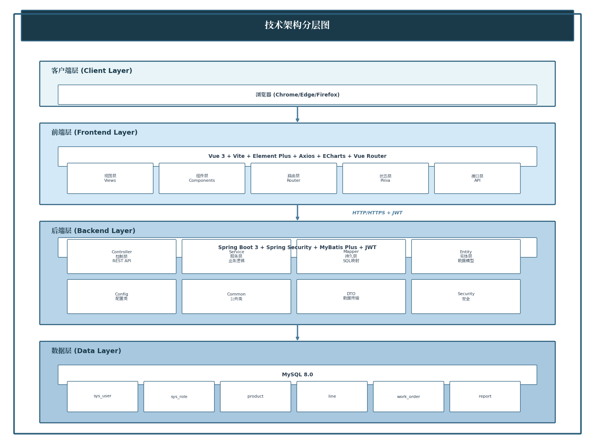

# SMT工单管理系统

## 一、项目背景与目标

1.1 项目背景

SMT（Surface Mount Technology，表面贴装技术）是电子制造行业中将电子元件贴装到印刷电路板(PCB)上的核心技术。随着电子产品向微型化、复杂化演进，企业对生产过程的精细化管理需求日益迫切。传统的纸质工单和人工管理方式存在以下不足：

| 不足 | 描述 |
| --- | --- |
| 工单更新不及时 | 纸质工单更新较慢，难以确定生产进度 |
| 质量追溯困难 | 纸质记录难以实现全流程追溯 |
| 信息孤岛 | 设备数据无法实时监控，无法实现数据共享 |
| 数据分析困难 | 难以实现多维度数据统计 |

1.2 项目目标

开发一套基于web的SMT工单管理系统，实现以下功能：

- 工单全流程电子化管理
- 生产进度实时追踪
- 设备数据实时监控
- 质量数据记录
- 多维度统计报表

## 二、项目架构

2.1 技术架构分层图

2.2 模块功能架构图

2.3 部署架构图